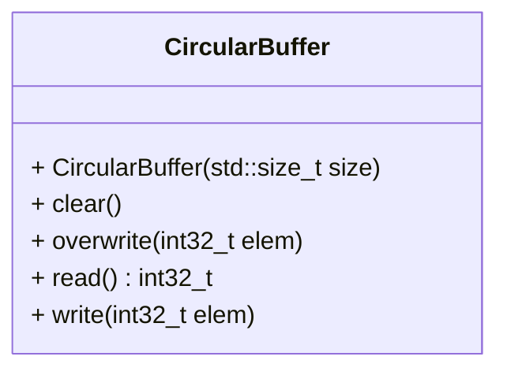

[](README.md)
[](README.de-at.md)

# Circular Buffer für ganze Zahlen (`int32_t`)

Nach Abschluss der Aufgaben können die folgenden Befehle ausgeführt werden,
um die Richtigkeit der Lösung zu prüfen.

```shell
mkdir build && cd build
cmake ..
make -j4
make test
```

Alternativ zu `make test` können die einzelnen `test_*` Programme ausgeführt
werden.


## Aufgabenstellung

Ein Circular Buffer ist eine Datenstruktur,
die einen Puffer fester größe so verwendet, als wäre er das Ende mit dem
Anfang verbunden. Circular buffers sind besonders nützlich zum Puffern von
Datenströmen. Sie eignen sich gut als FIFO (First In, First Out) – zum Beispiel
für eine Warteschlange mit fester Maximalgröße. In einigen Situationen ist das
Überschreiben von Daten in einem Circular Buffer nützlich, z. B. bei der
Arbeit mit Multimedia.

Da die C++-Standardbibliothek im C++20-Standard keinen Circular Buffer bietet,
bittet Sie Ihre Vorgesetzte, eine Lösung zu implementieren, die in den
Produkten Ihres Unternehmens verwendet werden kann.

Ein zirkulärer Puffer beginnt zunächst leer und mit einer vordefinierten Länge.
Folgendes Beispiel verwendet einen Circular Buffer mit 7 Elementen.

```text
[ ][ ][ ][ ][ ][ ][ ]
```

Angenommen, eine `1` wird in den Buffer geschrieben (der genaue
Startort spielt in einem Circular Buffer keine Rolle).

```text
[ ][ ][ ][1][ ][ ][ ]
```

Dann werden zwei weitere Elemente – `2` & `3` – hinzugefügt, die nach der 1
angehängt werden.

```text
[ ][ ][ ][1][2][3][ ]
```

Wenn dann zwei Elemente aus dem Puffer entfernt werden, werden die ältesten
Werte im Puffer entfernt.
Die beiden entfernten Elemente sind in diesem Fall `1` & `2`, wodurch der
Puffer nur noch eine 3 enthält.

```text
[ ][ ][ ][ ][ ][3][ ]
```

Wenn der Buffer 7 Elemente hat, ist er vollständig gefüllt.

```text
[5][6][7][8][9][3][4]
```

Wenn der Buffer voll ist, wird ein `std::domain_error` ausgelöst, der den
Nutzer darauf hinweist, dass weitere Schreibvorgänge blockiert sind, bis ein
Platz frei wird.

Wenn der Buffer voll ist, kann der Client die Funktion `overwrite` verwenden,
um die ältesten Daten mit einem erzwungenen Schreibvorgang zu überschreiben.
In diesem Fall werden zwei weitere Elemente – `A` & `B` – hinzugefügt und
überschreiben die `3` & `4`.

```text
[5][6][7][8][9][A][B]
```

`3` & `4` wurden durch `A` & `B` ersetzt, wodurch `5` nun das älteste Element
im Puffer ist.
Wenn nun zwei Elemente entfernt werden, so werden `5` & `6` zurückgegeben.
`7` ist jetzt das älteste Element im Buffer.
Der Buffer sieht danach wie folgt aus.

```text
[ ][ ][7][8][9][A][B]
```

Da nun Platz vorhanden ist, wird dieser freie Platz verwendet, wenn der Nutzer
erneut overwrite aufruft um `C` & `D` zu speichern.
`7` ist immer noch das älteste Element und der Puffer ist wieder voll.

```text
[C][D][7][8][9][A][B]
```

Um sicherzustellen, dass die Implementierung auf vielen Plattformen und
Microcontrollern funktioniert, möchte Ihre Vorgesetzte, dass Sie lediglich
`<cstddef>` und `<cstdint>` verwenden.
Nach einer längeren Diskussion konnten Sie sie davon überzeugen, dass `<vector>`
auf allen unterstützten Plattformen verfügbar sein wird. Das bedeutet, dass
`<cstddef>`, `<cstdint>` und bei Bedarf `<vector>` (aber keine anderen
Header) verwendet werden dürfen, um diese Aufgabe zu lösen.

Der Buffer muss die folgende öffentliche API bereitstellen:



## Erforderliches Verhalten

Es spielt keine Rolle, welche zugrunde liegende Datenstruktur für die
Implementierung verwendet wird. Alle Methoden müssen jedoch eine amortisiert
konstante Laufzeit ($O(1)$) haben.

Alle öffentlichen Methoden müssen sich wie in den obigen Anweisungen verhalten.
Wann immer eine Exception auftritt, ist `std::domain_error` mit einer
passenden Nachricht zu verwenden.

`clear()` setzt den Buffer zurück, sodass er sich wie ein neues Objekt verhält
