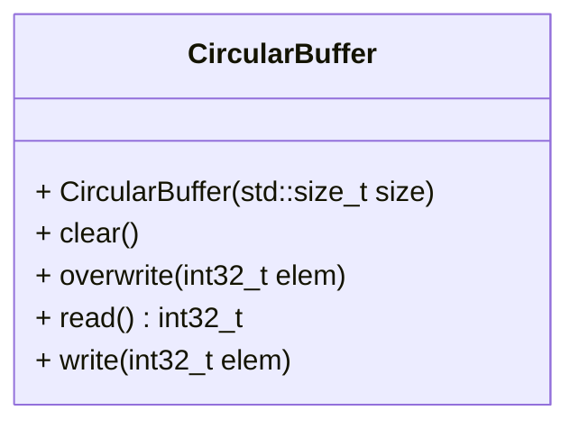

[](README.md)
[](README.de-at.md)

# Circular Buffer for Integers (`int32_t`)

After finishing the below tasks, run the following commands to see if your code
is correct.

```shell
mkdir build && cd build
cmake ..
make -j4
make test
```

As an alternative to `make test` (or `ctest`) you can run the individual
`test_*` executables.


## Instructions

A circular buffer, cyclic buffer or ring buffer is a data structure that uses a
single, fixed-size buffer as if it were connected end-to-end. Circular buffers
are particularly useful for buffering data streams. It is
well-suited as a FIFO (first in, first out) - for example for a queue that has
fixed maximum size. In some situations, overwriting data in a circular buffer
is useful, e.g. when working with multimedia.

As the C++ standard library in the C++20 standard does not offer a circular
buffer, your superior asks you to implement a solution that can be used
in your company's products.

A circular buffer first starts empty and of some predefined length.
For example, this is a 7-element buffer:

```text
[ ][ ][ ][ ][ ][ ][ ]
```

Assume that a `1` is written into the middle of the buffer (exact starting
location does not matter in a circular buffer):

```text
[ ][ ][ ][1][ ][ ][ ]
```

Then assume that two more elements are added — `2` & `3` — which get appended
after the `1`:

```text
[ ][ ][ ][1][2][3][ ]
```

If two elements are then removed from the buffer, the oldest values inside the
buffer are removed.
The two elements removed, in this case, are `1` & `2`, leaving the buffer with 
just a `3`:

```text
[ ][ ][ ][ ][ ][3][ ]
```

If the buffer has 7 elements then it is completely full:

```text
[5][6][7][8][9][3][4]
```

When attemting to `write` to a full buffer, a `std::domain_error` has to
be raised. This alerts clients that further writes are blocked until a slot
becomes free.

When the buffer is full, the client can opt to `overwrite` the oldest data with
a forced write.
In this case, two more elements — `A` & `B` — are added and they overwrite the
`3` & `4`:

```text
[5][6][7][8][9][A][B]
```

`3` & `4` have been replaced by `A` & `B` making `5` now the oldest data in the
buffer. Finally, if two elements are removed then what would be returned is
`5` & `6` yielding the buffer. Now `7` is the oldest element in the buffer:

```text
[ ][ ][7][8][9][A][B]
```

Because there is space available, if the client again uses overwrite to store
`C` & `D` then the space where `5` & `6` were stored previously will be used 
not the location of `7` & `8`.
`7` is still the oldest element and the buffer is once again full.

```text
[C][D][7][8][9][A][B]
```

To ensure that your implementation works on many embedded platforms, your
superior wants you to solely rely on `<cstddef>` and `<cstdint>`.
After a longer discussion, you managed to convince her that `<vector>` will
be available on all supported platforms. That means you may use
`<cstddef>`, `<cstdint>` and `<vector>` but no other headers to solve this
task.

Your buffer must provide the following public API:



## Required behavior

It does not matter which underlying data structure you implement. However, all
methods must have amortized constant ($O(1)$) runtime.

All public methods must behave as in the instructions above.
Whenever an exception occurs, use `std::domain_error` with an appropriate
message.

`clear()` clear the data in the buffer so it behaves like a new object
